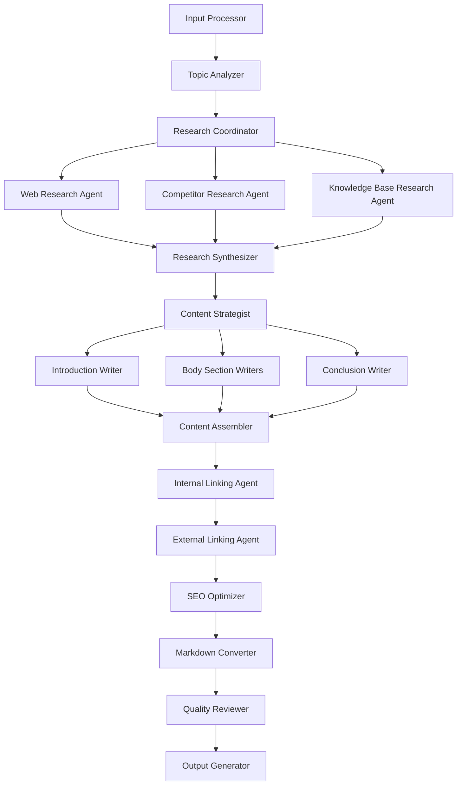

# SEO Blog Writer System - Node-by-Node Overview

## System Architecture Overview

This multi-agent blog writing system is designed as a LangGraph workflow with specialized nodes handling different aspects of blog creation. The system takes a brief idea and produces a complete, SEO-optimized blog post with internal/external linking.

## Node Breakdown

### 1. **Input Processor Node**
**Purpose**: Parse and validate the initial blog idea
- **Input**: Raw blog idea/brief description
- **Processing**: 
  - Extract key topics and themes
  - Validate input completeness
  - Set initial parameters
- **Output**: Structured blog request object
- **Next Nodes**: Topic Analyzer

### 2. **Topic Analyzer Node**
**Purpose**: Analyze the topic and determine research scope
- **Input**: Structured blog request
- **Processing**:
  - Identify main topic and subtopics
  - Determine target audience
  - Assess topic complexity and scope
  - Generate research questions
- **Output**: Topic analysis with research roadmap
- **Next Nodes**: Research Coordinator

### 3. **Research Coordinator Node**
**Purpose**: Plan and orchestrate research activities
- **Input**: Topic analysis and research roadmap
- **Processing**:
  - Create research plan
  - Identify research priorities
  - Determine which research agents to activate
- **Output**: Research execution plan
- **Next Nodes**: Web Research Agent, Competitor Research Agent, Knowledge Base Research Agent

### 4. **Web Research Agent**
**Purpose**: Conduct general web research on the topic
- **Input**: Research questions and topics
- **Processing**:
  - Search for current information
  - Gather statistics and data
  - Find authoritative sources
  - Collect recent developments
- **Output**: Web research findings
- **Next Nodes**: Research Synthesizer

### 5. **Competitor Research Agent**
**Purpose**: Analyze competitor content and identify gaps
- **Input**: Topic and business context
- **Processing**:
  - Identify competing content
  - Analyze competitor approaches
  - Find content gaps and opportunities
  - Avoid prohibited external links
- **Output**: Competitor analysis report
- **Next Nodes**: Research Synthesizer

### 6. **Knowledge Base Research Agent**
**Purpose**: Search internal content for relevant information
- **Input**: Topic and existing content database
- **Processing**:
  - Search existing blog posts
  - Identify related internal content
  - Find potential internal linking opportunities
  - Extract relevant insights
- **Output**: Internal content analysis
- **Next Nodes**: Research Synthesizer

### 7. **Research Synthesizer Node**
**Purpose**: Combine all research into a coherent knowledge base
- **Input**: All research outputs from research agents
- **Processing**:
  - Merge and deduplicate findings
  - Identify key insights and data points
  - Create comprehensive research summary
  - Prioritize information by relevance
- **Output**: Synthesized research report
- **Next Nodes**: Content Strategist

### 8. **Content Strategist Node**
**Purpose**: Plan the blog structure and content strategy
- **Input**: Synthesized research report and topic analysis
- **Processing**:
  - Create blog outline
  - Define target title options
  - Plan section breakdown
  - Identify key messages and CTAs
  - Determine content tone and style
- **Output**: Content strategy and detailed outline
- **Next Nodes**: Introduction Writer, Body Section Writers, Conclusion Writer

### 9. **Introduction Writer Agent**
**Purpose**: Create compelling blog introduction
- **Input**: Content strategy and research summary
- **Processing**:
  - Write engaging hook
  - Introduce topic and value proposition
  - Set up the blog structure
- **Output**: Introduction section
- **Next Nodes**: Content Assembler

### 10. **Body Section Writer Agents** (Multiple instances)
**Purpose**: Write individual sections of the blog body
- **Input**: Section outline and relevant research
- **Processing**:
  - Develop section content
  - Include data and examples
  - Ensure logical flow
  - Write in consistent style
- **Output**: Individual blog sections
- **Next Nodes**: Content Assembler

### 11. **Conclusion Writer Agent**
**Purpose**: Create strong conclusion and call-to-action
- **Input**: Content strategy and written sections
- **Processing**:
  - Summarize key points
  - Create compelling CTA
  - Encourage engagement
- **Output**: Conclusion section with CTA
- **Next Nodes**: Content Assembler

### 12. **Content Assembler Node**
**Purpose**: Combine all sections into cohesive blog post
- **Input**: All written sections (intro, body, conclusion)
- **Processing**:
  - Merge sections logically
  - Ensure consistent tone and flow
  - Add transitions between sections
  - Perform initial quality check
- **Output**: Complete draft blog post
- **Next Nodes**: Internal Linking Agent

### 13. **Internal Linking Agent**
**Purpose**: Add internal links to existing content
- **Input**: Draft blog post and internal content database
- **Processing**:
  - Identify linking opportunities
  - Match content to existing posts
  - Insert contextual internal links
  - Ensure link relevance and value
- **Output**: Blog post with internal links
- **Next Nodes**: External Linking Agent

### 14. **External Linking Agent**
**Purpose**: Add relevant external links (non-competitor)
- **Input**: Blog post with internal links
- **Processing**:
  - Identify authoritative external sources
  - Avoid competitor websites
  - Add credible references
  - Ensure link quality and relevance
- **Output**: Blog post with all links
- **Next Nodes**: SEO Optimizer

### 15. **SEO Optimizer Node**
**Purpose**: Generate all SEO-related metadata and optimizations
- **Input**: Complete blog post with links
- **Processing**:
  - Generate meta title and description
  - Create relevant tags and categories
  - Optimize for target keywords
  - Generate alt text for images
  - Create schema markup suggestions
  - Generate social media previews
- **Output**: SEO metadata package
- **Next Nodes**: Markdown Converter

### 16. **Markdown Converter Node**
**Purpose**: Convert content to properly formatted markdown
- **Input**: Blog post with SEO metadata
- **Processing**:
  - Convert to markdown format
  - Add proper heading hierarchy
  - Format links and lists
  - Include metadata as frontmatter
- **Output**: Markdown-formatted blog post
- **Next Nodes**: Quality Reviewer

### 17. **Quality Reviewer Node**
**Purpose**: Final quality check and validation
- **Input**: Complete markdown blog post
- **Processing**:
  - Check for consistency and quality
  - Validate all links
  - Ensure SEO best practices
  - Format verification
  - Generate quality score
- **Output**: Final blog post with quality report
- **Next Nodes**: Output Generator

### 18. **Output Generator Node**
**Purpose**: Prepare final deliverables
- **Input**: Reviewed blog post and quality report
- **Processing**:
  - Generate final markdown file
  - Create summary report
  - Package all deliverables
- **Output**: Complete blog package ready for review

## Workflow Connections

## Key Features

1. **Parallel Processing**: Multiple research agents and section writers can work simultaneously
2. **Quality Gates**: Each major phase includes validation and quality checks
3. **Modular Design**: Individual nodes can be updated or replaced independently
4. **Error Handling**: Each node includes error recovery and retry logic
5. **Configuration**: System behavior can be customized through configuration parameters

## State Management

The system maintains a comprehensive state object that tracks:
- Original request and requirements
- Research findings and insights
- Content sections and progress
- SEO metadata and optimization
- Quality metrics and feedback

This architecture ensures each agent has a clear, focused responsibility while maintaining the overall coherence and quality of the final blog post. 